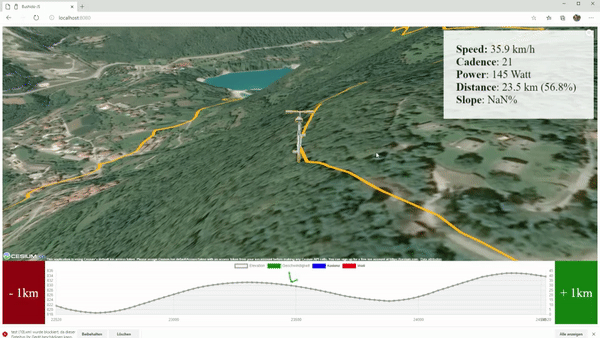

# trainer.js

trainer.js is a Typescript application that lets you experience recorded gpx tracks on your home trainer.

The features of the webapp are:
- loading and smoothing of a GPX route
- connecting to your Bushido trainer (via WebUSB)
- collecting metrics like power, speed, cadence and heart rate
- adjusting slope depending on your current position on the GPX route
- rendering your position into a 3d environment via CesiumJS
- exporting your stats as a GPX file, so you can share your efforts on Strava or elsewhere

# Supported Trainers

Currently there's only one supported bike trainer, but adding others should be fairly easy.
With you support, I hope, more trainers will be added soon!

- Tacx Bushido (t1980)

## Adding a new trainer

Connecting your trainer to the Simulation requires a driver first. What is special about trainer.js is, that it already provides a basic ANT+ driver implementation that works via WebUSB. New drivers can build upon this functionality and will work out of the box. A user only needs to load the webpage and all USB control will be handled by bike.js.

## WebUSB Driver

Checkout [the basic ANT+ driver file](./src/AntDriver.ts) for a very lightweight ANT+ driver. It yet handles the very basic message formats, that were needed for the Bushido (t1980).

The [Bushido driver](./src/trainers/BushidoTrainer.ts) builds up on the ANT+ driver and adds only some proprietary messages and the special communication logic. It is capable of reading speed, distance, power, cadence and heart rate from the Bushido control unit. Furthermore, it lets you control the device's simulated slope. The Bushido communication protocol is closed source. However, there have been successful attempts in deciphering the different messages. You can [find the documentation here](https://github.com/fluxoid-org/CyclismoProject/wiki/Tacx-Bushido-Headunit-protocol).
